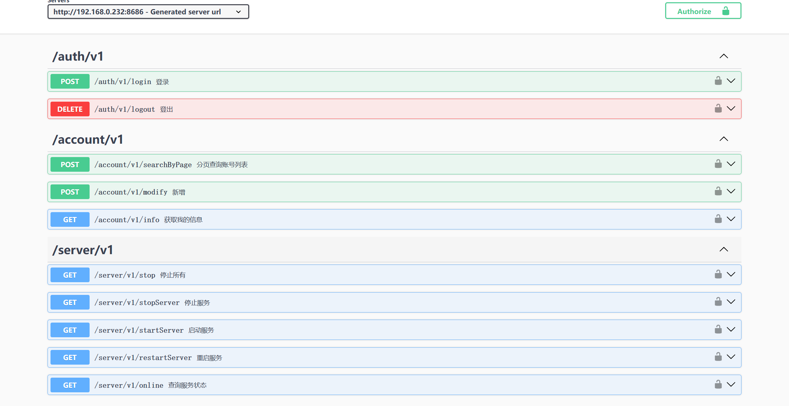
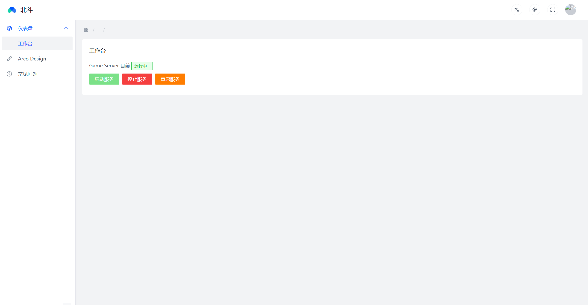

本项目基于Cosmic来的汉化和优化，Cosmic地址：https://github.com/P0nk/Cosmic   

# BeiDou由来
北斗卫星导航系统（Beidou Navigation Satellite System，简称：BDS，又称为：COMPASS，中文音译名称：BeiDou）是中国自行研制的全球卫星导航系统，也是继GPS、GLONASS之后的第三个成熟的卫星导航系统。北斗卫星导航系统（BDS）和美国GPS、俄罗斯GLONASS、欧盟GALILEO，是联合国卫星导航委员会已认定的供应商。  
北斗卫星导航系统由空间段、地面段和用户段三部分组成，可在全球范围内全天候、全天时为各类用户提供高精度、高可靠定位、导航、授时服务，并且具备短报文通信能力。经过多年发展，北斗系统已成为面向全球用户提供全天候、全天时、高精度定位、导航与授时服务的重要新型基础设施。北斗系统定位导航授时服务，通过30颗卫星，免费向全球用户提供服务，全球范围水平定位精度优于9米、垂直定位精度优于10米，测速精度优于0.2米/秒、授时精度优于20纳秒。  
北斗这一词对于中国来说，有着特殊的意义。北斗，是中国的一个卫星导航系统，也是中国自主研制的第一个卫星导航系统。既然小伙伴说这个项目也要整个天体的名字，想了半天，就叫北斗好了！这也意味着我们要做的比HeavenMS和Cosmic更加优秀和强大！  

# gms-server 服务端
- 已实现自动创建数据库，执行初始化sql脚本，只要保证mysql是启动的即可  
- 已开放api端口8686
- 已引入swagger，swagger地址：http://localhost:8686/swagger-ui/index.html
- 接口由版本控制，如：v1 v2 v3。默认的swagger标签为name = ApiConstant.LATEST，默认的RequestMapping为："/" + ApiConstant.LATEST + "/xx"
- 接口如果增加新版本且接口不需要更新，只需要把ApiConstant.LATEST指向新版本即可。如果部分接口不兼容，需要把旧接口的Tag和RequestMapping都改成指定版本，如：ApiConstant.V1。其他的，只需要把ApiConstant.LATEST指向新版本即可。
- 支持多语言，脚本和wz针对多语言会读取不同的路径：wz-zh-CN，wz-en-US，script-zh-CN，script-en-US

## 开发环境
- OpenJDK 21：https://jdk.java.net/archive/
- Intellij IDEA：https://www.jetbrains.com/idea/
- MySQL8：https://github.com/SleepNap/NapMysqlTool/releases/latest 或者 https://downloads.mysql.com/archives/community/
- Maven：https://maven.apache.org/download.cgi
- git：https://git-scm.com/downloads
- DBeaver：https://dbeaver.io/download/

## 开发进展

# gms-ui web端

## 开发环境
- nvm(可选)：https://github.com/coreybutler/nvm-windows/releases/latest
- Node.js18：https://nodejs.org/en/download/prebuilt-installer
- Yarn：npm i -g yarn
- Visual Studio Code：https://code.visualstudio.com/
- git：https://git-scm.com/downloads

## 开发进展

# 客户端
> **版号** 从1开始每次更新都+1，只为了区分不同版本，没有严格定义是更新功能还是修复bug。

由于网盘空间有限，原则上客户端看心情打包一次，请自行依次下载补丁更新。

## 客户端下载
默认为英文客户端，如需汉化 1.编辑config.ini将SwitchChinese的值改为true；2.将CN包里的文件复制（覆盖）到Data目录下，即可。
- BeiDou V6： https://mega.nz/file/DLQAxJCD#Au-hzXWSVywpeXetTZKx6_rNihXdbOfyDsRa9Ohmazg
基本已汉化，尚未汉化部分可提issue或者其他方式告知。
- ~~BeiDou V3： https://mega.nz/file/qXw3iRCA#S8e21nDeomANjPfEUjhGtTzCzXsebU_fXmeEHY9ZXDQ
完成度：能用，暂未汉化；支持中文输入；使用img资源。~~

## 补丁下载
使用方法：按顺序下载补丁，直接覆盖到客户端内即可；wz补丁仅供开发用。

### 2024/6/20
更新说明：
1. 新增汉化：物品的物品锁ToolTip：封印至 XXX
2. 修复4处汉化后日期格式错误，由月日年的顺序修正为年月日的顺序
3. 商城位置回调至居中 
4. 交易中心位置居中
- V6: https://mega.nz/file/LfYAXLxI#uIcnww5rStbx9zvaRrIJDqtM7tbKgVSqdjcZCVycfsg
- V6-wz： https://mega.nz/file/qTBU1ZzY#VctdSTdhGCoZ6H_PCQom2qhzrWVQgnahXYcalREShNo

### 2024/6/19
更新说明：
1. 汉化，并增加语言包。如需中文，在config.ini中设置SwitchChinese=true，并且将CN包中的资源复制(覆盖)到Data目录下
2. 商城界面移至左上角不再居中
3. 任务尚未汉化
- V5： https://mega.nz/file/iaoAiK4a#1okrn1V_HW_pkxlKNGQZXtGJu3tixY7b2vTtIHv4u18
- V5-wz： https://mega.nz/file/nH5UzCQT#NHx6y5ZTDDlZllXZBtOHGLdxDkkR8sGHzNBZHC22P1o

### 2024/6/18
更新说明：支持长键盘快捷键
- V4： https://mega.nz/file/7CwDQTqY#wzY33C2MQ8OS3_FJTjqPe9mFKmoZxPfinTMQ0vyf5cs
- ~~V4-wz： https://mega.nz/file/vaYSFLwa#-AmaJLzxDpQXzTt09bRpmbknoytTVwCSSkOjqS5hnaA V5-wz可替代~~

## 开发可选
仅供需要编辑开发的人使用

- ijl15 插件： https://github.com/leevccc/BeiDou-ijl15/tree/BeiDou
- BeiDou V6 wz： https://mega.nz/file/XWQGCTDA#7Ar-5YTO1anZ7yfq2JfQCHA38Wp8AyAYPnSG4xhI8k4
- ~~BeiDou V3 wz： https://mega.nz/file/nbpl1JhT#uPw5eGVJM3tz245WUdCBJIRqkJcoDYzBsTBmEBmeMmM~~
