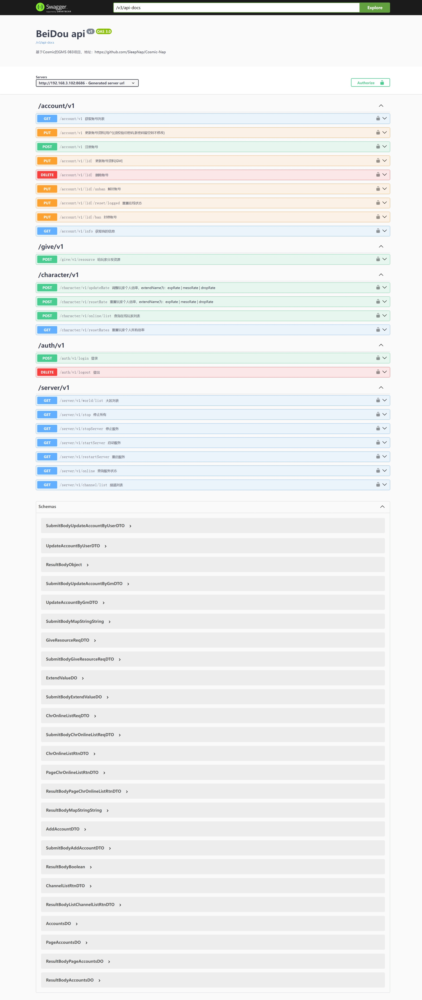
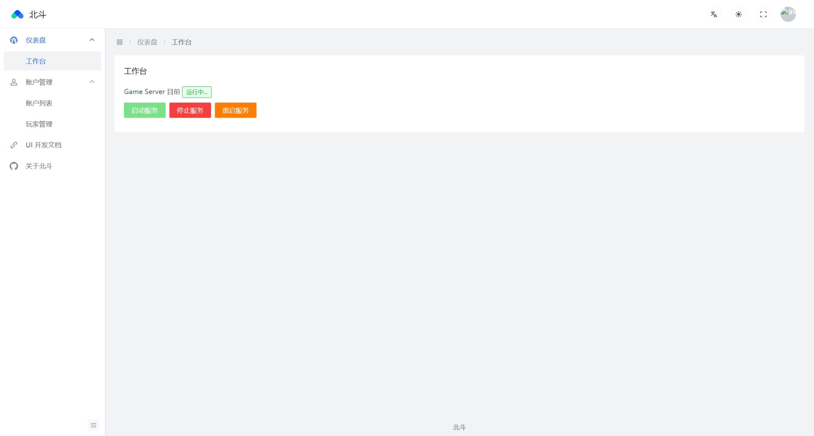
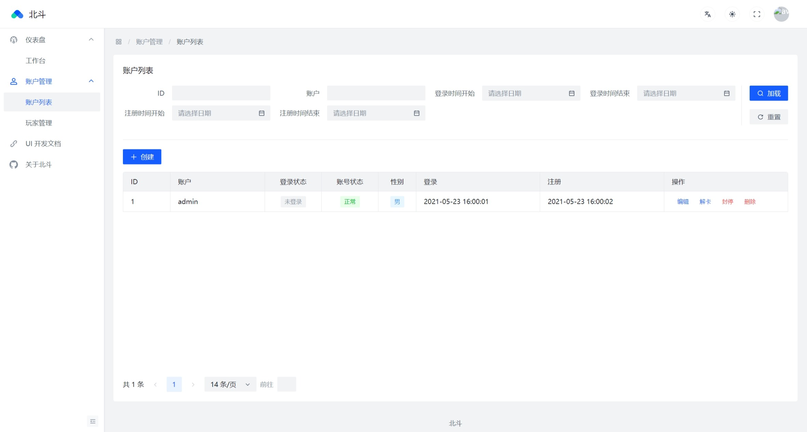
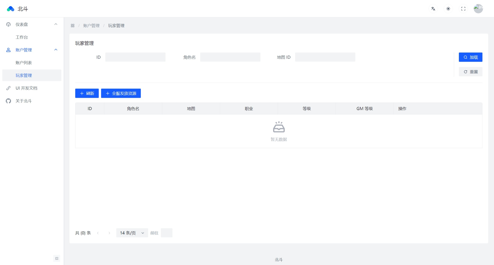
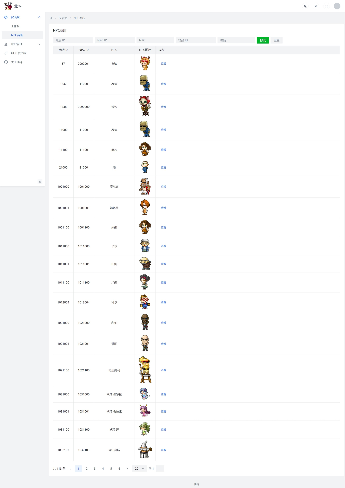

本项目基于Cosmic来的汉化和优化，Cosmic地址：https://github.com/P0nk/Cosmic   

# BeiDou由来
北斗卫星导航系统（Beidou Navigation Satellite System，简称：BDS，又称为：COMPASS，中文音译名称：BeiDou）是中国自行研制的全球卫星导航系统，也是继GPS、GLONASS之后的第三个成熟的卫星导航系统。北斗卫星导航系统（BDS）和美国GPS、俄罗斯GLONASS、欧盟GALILEO，是联合国卫星导航委员会已认定的供应商。  
北斗卫星导航系统由空间段、地面段和用户段三部分组成，可在全球范围内全天候、全天时为各类用户提供高精度、高可靠定位、导航、授时服务，并且具备短报文通信能力。经过多年发展，北斗系统已成为面向全球用户提供全天候、全天时、高精度定位、导航与授时服务的重要新型基础设施。北斗系统定位导航授时服务，通过30颗卫星，免费向全球用户提供服务，全球范围水平定位精度优于9米、垂直定位精度优于10米，测速精度优于0.2米/秒、授时精度优于20纳秒。  
北斗这一词对于中国来说，有着特殊的意义。北斗，是中国的一个卫星导航系统，也是中国自主研制的第一个卫星导航系统。既然小伙伴说这个项目也要整个天体的名字，想了半天，就叫北斗好了！这也意味着我们要做的比HeavenMS和Cosmic更加优秀和强大！  

# gms-server 服务端
- 已实现自动创建数据库，执行初始化sql脚本，只要保证mysql是启动的即可  
- 已开放api端口8686
- 已引入swagger，swagger地址：http://localhost:8686/swagger-ui/index.html
- 接口由版本控制，如：v1 v2 v3。默认的swagger标签为name = ApiConstant.LATEST，默认的RequestMapping为："/" + ApiConstant.LATEST + "/xx"
- 接口如果增加新版本且接口不需要更新，只需要把ApiConstant.LATEST指向新版本即可。如果部分接口不兼容，需要把旧接口的Tag和RequestMapping都改成指定版本，如：ApiConstant.V1。其他的，只需要把ApiConstant.LATEST指向新版本即可。
- 支持多语言，脚本和wz针对多语言会读取不同的路径：wz-zh-CN，wz-en-US，script-zh-CN，script-en-US
- 不支持MySQL8以下的版本

## 开发环境
- OpenJDK 21：https://jdk.java.net/archive/
- Intellij IDEA 2023.3及以上：https://www.jetbrains.com/idea/
- MySQL8：https://github.com/SleepNap/NapMysqlTool/releases/latest 或者 https://downloads.mysql.com/archives/community/
- Maven：https://maven.apache.org/download.cgi
- git：https://git-scm.com/downloads
- DBeaver：https://dbeaver.io/download/ 或者 Navicat Lite：https://www.navicat.com/en/download/navicat-premium-lite

## 开发进展


# gms-ui web端

## 开发环境部署

请根据自身实际情况选择性跳过已完成的步骤

**1 安装 NodeJS v20.15.0 （LTS 版）**

下载地址：https://nodejs.org/dist/v20.15.0/node-v20.15.0-x64.msi

**2 安装 Yarn**

```shell
npm install -g yarn
```

> 如提示npm命令不存在，可能是安装NodeJS时，安装程序配置的环境变量还没有生效，小白请使用重启大法

**3 初始化前端开发环境**

在命令行进入 gms-ui 目录，然后执行命令

```shell
yarn install
```

**4 启动开发环境**

```shell
yarn dev
```

## 开发进展





## 备注
web中所有的图片均需要联网获取，感谢https://maplestory.io提供给的图片接口！  

# 客户端
## 客户端下载
默认为英文客户端，如需汉化
1. 编辑config.ini将SwitchChinese的值改为true；
2. 将CN包里的文件复制（覆盖）到Data目录下，即可。

**客户端本体**
- BeiDou V7： https://mega.nz/file/2aRjCDIb#FwzR04lyfE-6bdSXLYwY3YxSRVwJaXCjbOvbe3hysW8
- ~~BeiDou V6： https://mega.nz/file/DLQAxJCD#Au-hzXWSVywpeXetTZKx6_rNihXdbOfyDsRa9Ohmazg
  基本已汉化，尚未汉化部分可提issue或者其他方式告知。~~
- ~~BeiDou V3： https://mega.nz/file/qXw3iRCA#S8e21nDeomANjPfEUjhGtTzCzXsebU_fXmeEHY9ZXDQ
  完成度：能用，暂未汉化；支持中文输入；使用img资源。~~

## 更新记录及补丁下载
使用方法：按顺序下载补丁，直接覆盖到客户端内即可；**wz补丁仅供开发用**。

汉化需重新覆盖 CN 包
### 2024/7/20 V9
更新说明：
1. 新增 突破跳跃上限
2. 新增 免密模式（须服务端支持） 
3. 更新 重新实现输入法IME的支持方案，解决老方案win11下不生效的问题（测试） 
4. 更新 聊天框文字位置 
5. 修复 部分NPC对话内容含中文时，内容被截断的问题 
6. 更新 玩家名片卡中职业信息字体
7. 补充 V7 打包打漏的 List.wz 文件
- v9：https://mega.nz/file/THxxEDQR#oFHvCc708PLxwQCFDRCNktp0Yhhg0vaRCFpkr0HYhiw
- v9-wz：https://mega.nz/file/WeBCiL6D#CpGxfBKeC0EGFtYKY5-toeBkR4yuPgomZIcUAJf-m48

### 2024/7/12 V8
更新说明：
1. 新增 命中/回避 上限解除
2. 修复 魔攻伤害计算没有破攻的问题
3. 新增 Boss 血条下方增加百分比
- v8：https://mega.nz/file/LTBGGKrL#DjQuTAywtCOFjz0Xn_3dFvxI33a9PsER6-GFXMTuGa4

[了解更多](CLIENT-UPDATE.md)